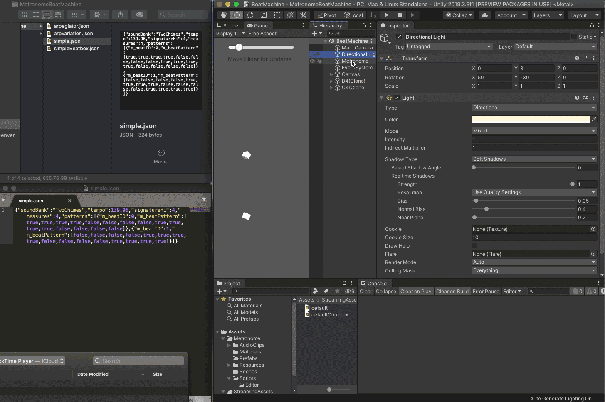

# MetronomeBeatMachine
A metronome based on the [Unity DSP Time Example](https://docs.unity3d.com/ScriptReference/AudioSettings-dspTime.html). The main difference to the example is an option to turn on/off the metronome and I've added delegates and events so that notes instantiated into the scene will start listening for a beat or downbeat to play.

There are three scenes, the basic Metronome, a random chime scene and a step sequencer.  The random scene has a few controls to alter the randomness of the sounds. The step sequences is an implentation for the Editor using UIElements and includes the ability to save sequence patterns to a .json file including the sound file that should be triggered. 

The step sequencer is a fairly complex example of how to build things with UIElements, attaching callbacks and events in the Editor. Future goals would be to implement a similar interface for in game saving and playing.  The .json files are stored based on the operating system using [Application.persistentDataPath](https://docs.unity3d.com/ScriptReference/Application-persistentDataPath.html). Note - the Library folder is normally hidden on a Mac.

Demo animation for how the step sequencer works in the Editor.

